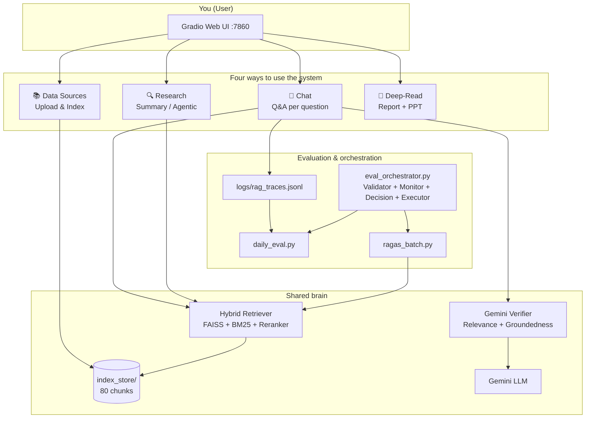
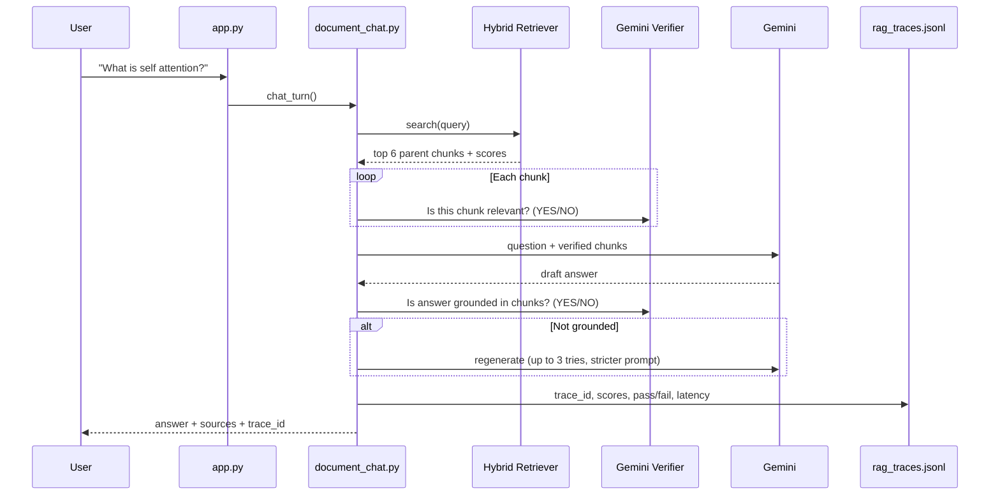
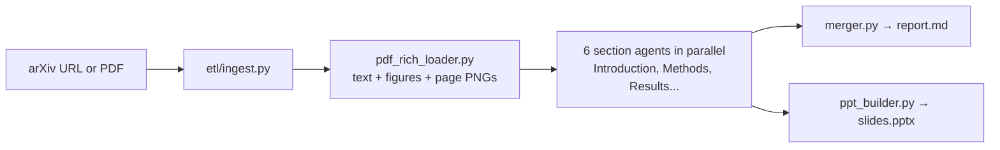

# Agentic RAG Research Assistant — Complete Project Guide

**For beginners.** This document explains what the system does, how data flows through it, and what each technology is for — without assuming you already know RAG, agents, or ML internals.

---

## 1. What is this project? (One sentence)

You upload a **research PDF** (for example the Transformer paper), the system **reads and indexes** it, and then you can **ask questions**, **get summaries**, or **generate a structured report + slides** — with checks so answers are **grounded in the document**, not made up.

Think of it as: **NotebookLM-style research assistant + evaluation dashboard**, built in Python.

---

## 2. What problem does it solve?

| Without this system | With this system |
|---------------------|------------------|
| ChatGPT answers from memory (may hallucinate) | Answers come from **your PDF text** |
| Long PDFs are hard to search manually | **Hybrid search** finds the right sections |
| No way to know if an answer is trustworthy | **Verification layer** grades relevance + groundedness |
| No metrics on quality | **Evaluation pipeline** logs scores and pass rates |

---

## 3. Tech stack (what each piece is)

| Technology | Role in plain English | Where in project |
|------------|----------------------|------------------|
| **Python 3** | Main programming language | Everything |
| **Gradio** | Web UI (tabs, buttons, chat) | `app.py` |
| **FastAPI** | REST API (e.g. feedback endpoint) | `app.py`, `api/` |
| **Google Gemini** | Large language model (reads text, writes answers, judges quality) | `config.py`, `verification/` |
| **LangChain** | Helper to call LLMs with prompts | `orchestration/` |
| **PyMuPDF / pdfplumber** | Read PDF text, tables, images | `etl/` |
| **Sentence Transformers (MiniLM)** | Turn text into numbers (embeddings) for similarity search | `retrieval/dense_retriever.py` |
| **FAISS** | Fast vector database (find similar embeddings) | `retrieval/dense_retriever.py` |
| **BM25** | Keyword search (exact word matching) | `retrieval/sparse_retriever.py` |
| **CrossEncoder (bge-reranker)** | Re-score search results for better ranking | `retrieval/hybrid_retriever.py` |
| **JSONL logs** | Line-by-line JSON files for traces and feedback | `logs/` |
| **asyncio** | Run multiple sub-tasks in parallel | `orchestration/agent.py` |

**Not in the Python app:** Cursor MCP and Cursor subagents are IDE features only. Your project’s “agents” are **Python modules** (`SubQueryAgent`, section agents, eval orchestrator).

---

## 4. Big picture architecture



---

## 5. The five tabs in the app

| Tab | What you do | What happens inside |
|-----|-------------|---------------------|
| **📚 Data Sources** | Upload PDF → Build Index | PDF → chunks → FAISS + BM25 → saved to disk |
| **💬 Chat with Documents** | Ask one question at a time | Retrieve → verify chunks → Gemini answer → verify answer |
| **🔍 Research** | Summarize or run multi-query research | Retrieve + LLM (simple) OR planner + parallel agents (full) |
| **📖 Deep-Read** | Paste arXiv/PDF URL | Extract figures/pages → 6 section summaries → report.md + slides.pptx |
| **⚙️ Configuration** | View settings | Reads `.env` and `config.py` |

**Start here every time:** Data Sources → upload PDF → Build Index → then use Chat or Research.

---

## 6. Phase A — Indexing (prepare the document)

**Goal:** Turn a PDF into a searchable “library” the computer can query quickly.

**This runs once per PDF (or when you re-upload).**

```text
PDF file
   │
   ▼
[1] pdf_loader.py          — extract text per page
   │
   ▼
[2] chunker.py             — split into:
       • Parent chunks (~1500 characters) — big context for the LLM
       • Child chunks (smaller, semantic) — used for search
   │
   ▼
[3] dense_retriever.py     — embed each child → FAISS vector index
[4] sparse_retriever.py    — BM25 keyword index on same children
[5] hybrid_retriever.py    — store parent documents in memory map
   │
   ▼
[6] Save to index_store/   — persists so you don't re-index every restart
```

**Example numbers (Transformer paper):** ~80 child vectors, parent chunks ~1500 chars each.

**Files:** `etl/pdf_loader.py`, `etl/chunker.py`, `retrieval/*`, `app.py` → `build_index_from_pdfs()`

---

## 7. Phase B — Chat pipeline (most important RAG flow)

**Goal:** Answer **one question** using **only** text from your indexed PDF.



### Step-by-step (beginner language)

1. **You type a question** in the Chat tab.
2. **Query normalization** — fixes small wording issues (e.g. `self attention` vs `self-attention`). File: `retrieval/query_utils.py`
3. **Hybrid search** — finds the best pieces of the PDF:
   - FAISS: “meaning similar” (top 20 candidates)
   - BM25: “keyword match” (top 20 candidates)
   - **RRF:** merge both lists into one ranking
   - Map small **child** hits → large **parent** paragraphs
   - **CrossEncoder reranker:** score query vs each parent (top 6 kept)
   - **Score filter:** drop chunks below cosine 0.35 (weak matches blocked)
4. **Relevance judge (per chunk)** — Gemini says YES/NO: “Is this chunk useful for the question?”
5. **Build context** — join passed chunks with source/page labels.
6. **Generate answer** — Gemini reads context + question (not the whole internet).
7. **Groundedness judge** — Gemini says YES/NO: “Is the answer supported by the context?”
8. **If fail** — regenerate up to **3 times** with stricter instructions.
9. **Log everything** — `logs/rag_traces.jsonl` (latency, scores, pass/fail).
10. **You can thumbs up/down** — saved to `logs/feedback.jsonl`.

**Key file:** `orchestration/document_chat.py`

---

## 8. Phase C — Research tab (two speeds)

### C1 — Simple summarize (default button)

```text
Goal text → hybrid search once → one Gemini call → summary
```

Fast. No sub-agents. File: `orchestration/simple_summarizer.py`

### C2 — Full agentic research (advanced)

```text
Research goal
   → ResearchPlanner (LLM splits into 3–4 sub-questions)
   → SubQueryAgent × N in parallel (asyncio.gather)
        each agent: retrieve → grade relevance → answer → check hallucination
   → ReportSynthesizer (merge into one report)
   → ChartGenerator (optional chart)
```

**“Agent” here** = one Python worker per sub-question with retrieve → judge → answer → verify.

**Files:** `orchestration/planner.py`, `orchestration/agent.py`, `orchestration/synthesizer.py`

---

## 9. Phase D — Deep-Read pipeline (separate from chat RAG)

**Goal:** First-time reader walkthrough — structured report + PowerPoint.



**Output folder:** `artifacts/deep_read/<job_id>/`

Does **not** use the same hybrid index as Chat (it reads the PDF directly per section).

**Files:** `orchestration/deep_read/orchestrator.py`

---

## 10. Evaluation layer (how you trust the system)

Your project measures quality in **layers** — like a health checkup:

| Layer | What it measures | Tool / file |
|-------|------------------|-------------|
| **Retrieval** | Did we find the right PDF sections? | `ragas_batch.py`, cosine scores |
| **Relevance** | Are retrieved chunks actually about the question? | `GeminiVerifier.is_relevant()` |
| **Faithfulness / Groundedness** | Is the answer supported by those chunks? | `GeminiVerifier.is_grounded()` |
| **Production monitoring** | Pass rate, latency, user thumbs | `daily_eval.py` |
| **Threshold tuning** | Best cosine cutoff (Precision@5, F1) | `threshold_optimizer.py` |
| **Self-healing** | Auto-fix when metrics drop | `self_healer.py` |
| **Offline golden set** | 30 labeled test questions | `golden_set.json` + `ragas_batch.py` |

### Your measured results (30-query golden set)

| Metric | Value |
|--------|-------|
| Retrieval F1 | **93.9%** |
| In-domain Hit@k | **95.8%** |
| Precision | **92%** |
| Context relevancy (reranker proxy) | **93.8%** |
| Faithfulness (LLM judge) | Needs Gemini quota (free tier: 20 calls/day) |

### Run evaluation yourself

```bash
cd research_assistant

# Full automated flow (validator + monitor + decision + executor)
python evaluation/eval_orchestrator.py

# Retrieval-only batch (no API)
python evaluation/ragas_batch.py

# Daily production metrics from chat logs
python evaluation/daily_eval.py
```

---

## 11. Eval orchestrator (your multi-agent automation)

**File:** `evaluation/eval_orchestrator.py`

Four logical agents work together:

```text
┌─────────────┐     ┌─────────────┐
│  VALIDATOR  │     │   MONITOR   │
│ index OK?   │     │ trace count │
│ API OK?     │     │ pass rate   │
│ tests pass? │     │ last F1     │
└──────┬──────┘     └──────┬──────┘
       │                   │
       └─────────┬─────────┘
                 ▼
         ┌───────────────┐
         │   DECISION    │
         │ API ok → LLM  │
         │ quota → proxy │
         └───────┬───────┘
                 ▼
         ┌───────────────┐
         │   EXECUTOR    │
         │ ragas_batch   │
         └───────────────┘
```

**Report saved to:** `evaluation/orchestrator_report.json`

---

## 12. Complete folder map

```text
research_assistant/
├── app.py                    ← Main UI + wiring
├── config.py                 ← All settings (.env)
├── .env                      ← API keys, model names
│
├── etl/                      ← INGEST: PDF → documents
│   ├── pdf_loader.py
│   ├── chunker.py
│   ├── ingest.py             ← Deep-Read URL → PDF
│   └── pdf_rich_loader.py    ← figures, pages, tables
│
├── retrieval/                ← SEARCH
│   ├── dense_retriever.py    ← FAISS + embeddings
│   ├── sparse_retriever.py   ← BM25
│   ├── hybrid_retriever.py   ← RRF + rerank + parents
│   ├── score_filter.py       ← block weak scores
│   └── query_utils.py        ← query normalization
│
├── orchestration/            ← ANSWER GENERATION
│   ├── document_chat.py      ← Chat RAG + verification
│   ├── agent.py              ← Parallel sub-query agents
│   ├── planner.py            ← Split goal into sub-questions
│   ├── simple_summarizer.py  ← Fast summarize
│   └── deep_read/            ← Report + PPT pipeline
│
├── verification/
│   └── gemini_verifier.py    ← Relevance + groundedness judge
│
├── observability/
│   ├── gemini_tracer.py      ← Write rag_traces.jsonl
│   └── feedback.py           ← Thumbs up/down
│
├── evaluation/
│   ├── daily_eval.py         ← Daily metrics
│   ├── ragas_batch.py        ← 30-query offline eval
│   ├── eval_orchestrator.py  ← Multi-agent automation
│   └── golden_set.json       ← Labeled test questions
│
├── optimization/             ← AUTO-TUNING (Level 5)
│   ├── threshold_optimizer.py
│   ├── prompt_optimizer.py
│   └── self_healer.py
│
├── index_store/              ← Saved search index
├── logs/                     ← Production traces + feedback
└── artifacts/deep_read/      ← Generated reports + slides
```

---

## 13. End-to-end user journey (copy this flow)

```text
1. Install dependencies → pip install -r requirements.txt
2. Set GEMINI_API_KEY in .env
3. Run app → python app.py  (opens http://127.0.0.1:7860)
4. Tab: Data Sources → upload Transformer PDF → Build Index
5. Tab: Chat → ask "What is self attention?" → get answer + sources
6. Tab: Deep-Read → paste arXiv URL → get report.md + slides.pptx
7. Run eval → python evaluation/eval_orchestrator.py
8. Check metrics → python evaluation/daily_eval.py
```

---

## 14. Glossary (slow-learner friendly)

| Term | Simple meaning |
|------|----------------|
| **RAG** | Retrieval-Augmented Generation — find text first, then generate answer |
| **Chunk** | A small piece of the PDF (like one paragraph) |
| **Embedding** | Numbers that represent meaning of text |
| **FAISS** | Library to search similar embeddings fast |
| **BM25** | Classic keyword search |
| **Hybrid retrieval** | Combine semantic (FAISS) + keyword (BM25) search |
| **Reranker** | Second model that re-orders search results for accuracy |
| **LLM-as-judge** | Use Gemini to grade YES/NO (relevant? grounded?) |
| **Faithfulness** | Answer only uses facts from retrieved text |
| **Agent** | In this project: a Python module that runs retrieve→judge→answer for one sub-task |
| **Trace** | One logged record of a chat request (scores, latency, pass/fail) |
| **Golden set** | Pre-written test questions with expected behavior for offline eval |

---

## 15. What makes this a “Data Science” project

- **Labeled evaluation** (30-query golden set with precision/recall/F1)
- **LLM-as-judge** metrics (relevance, groundedness)
- **Production logging** (JSONL traces, daily aggregates)
- **Hyperparameter tuning** (retrieval threshold grid search)
- **Closed-loop monitoring** (alerts, self-healing, orchestrator)
- **Honest reporting** (proxy vs LLM judge, sample size warnings)

---

## 16. Known limits (be honest in interviews)

- Index is small (~80 chunks, one paper) — not web-scale
- Free Gemini tier: ~20 API calls/day — blocks full faithfulness eval
- Production traces: only a few chat sessions logged so far
- Deep-Read and Chat use different pipelines (complementary, not identical)

---

*Last updated from codebase state: indexing, chat verification, Deep-Read, evaluation orchestrator, and ragas_batch metrics.*
